# 523案例结构图-考前速记

## 1. 总体做题框架

案例分析不是写作文，核心是识别题型并套关键词。

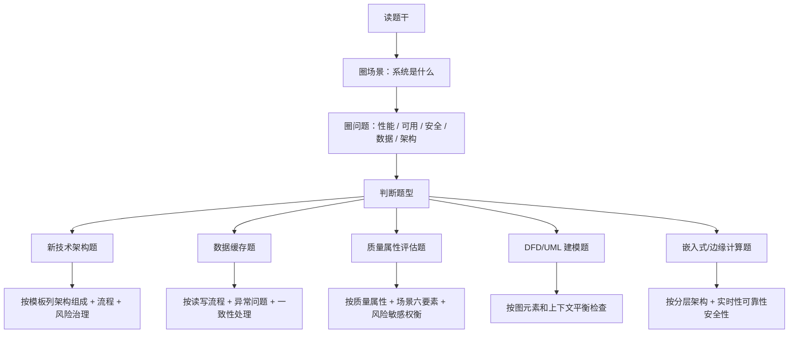

## 2. 第一优先级：大模型 / RAG / 知识图谱

### 2.1 结构图

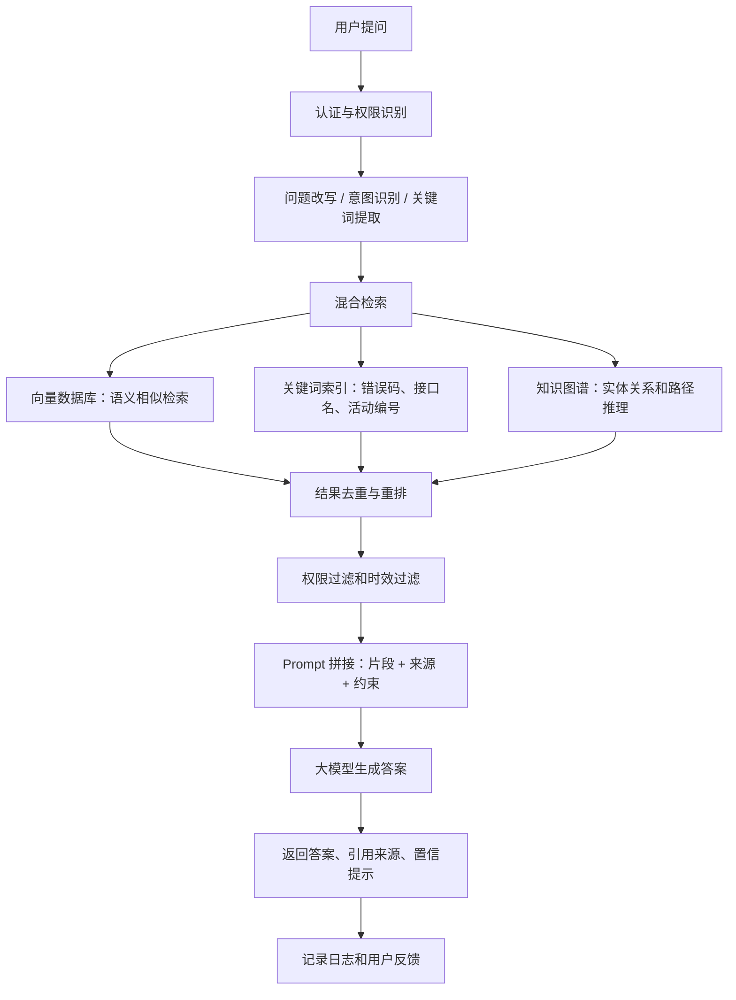

### 2.2 答题口令

```text
先治理知识，再混合检索，最后让大模型基于证据回答。
```

### 2.3 必写 5 点

```text
1. 文档解析、清洗、切分、元数据标注、向量化。
2. 向量库做语义检索，关键词索引做精确检索，知识图谱做关系推理。
3. RAG 流程包括认证、问题改写、混合检索、重排、Prompt 拼接、大模型生成。
4. 防幻觉靠引用来源、规则校验、知识图谱校验、资料不足时拒答。
5. 防泄露靠权限过滤、脱敏加密、模型网关和审计日志。
```

## 3. 第二优先级：云原生微服务 / 事件驱动

### 3.1 结构图

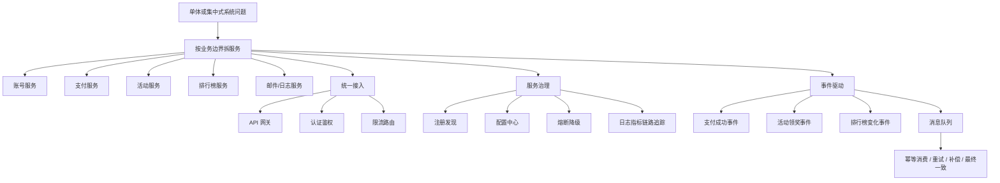

### 3.2 答题口令

```text
先按业务边界拆，再用网关和注册发现连，最后用事件驱动解耦。
```

### 3.3 必写 5 点

```text
1. 服务拆分不能按函数拆，要按业务边界和数据归属拆。
2. API 网关负责认证、鉴权、限流、路由和协议适配。
3. 注册发现解决服务扩缩容后的实例变化感知。
4. 可观测性包括日志、指标、链路追踪。
5. 事件驱动要处理可靠投递、幂等消费、失败重试和最终一致性。
```

## 4. 第三优先级：数据缓存高并发

### 4.1 Cache Aside 结构图

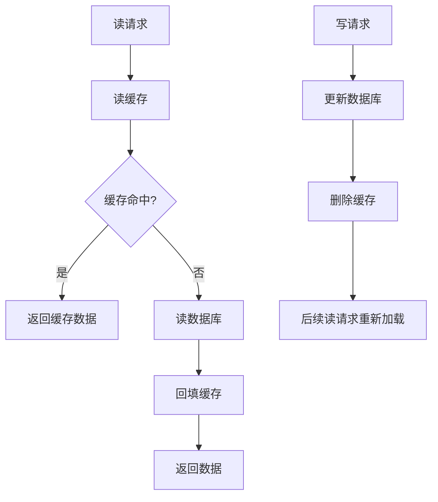

### 4.2 缓存问题结构图

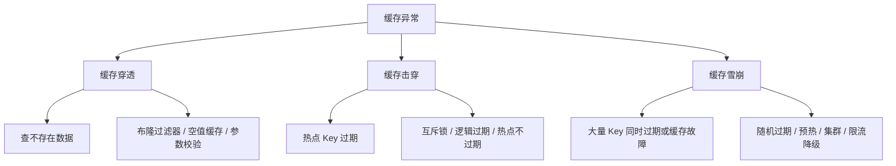

### 4.3 答题口令

```text
读先查缓存，未命中查库并回填；写先改库，再删缓存。
```

### 4.4 必写 5 点

```text
1. Cache Aside 读流程和写流程。
2. 缓存与数据库只能做到最终一致，关键链路要有补偿或校验。
3. 缓存穿透用布隆过滤器和空值缓存。
4. 缓存击穿用互斥锁和热点 Key 保护。
5. 缓存雪崩用随机过期、缓存预热、集群和限流降级。
```

## 5. 第四优先级：质量属性 / 架构评估

### 5.1 质量属性场景六要素图

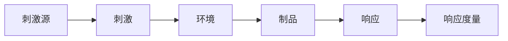

### 5.2 效用树图

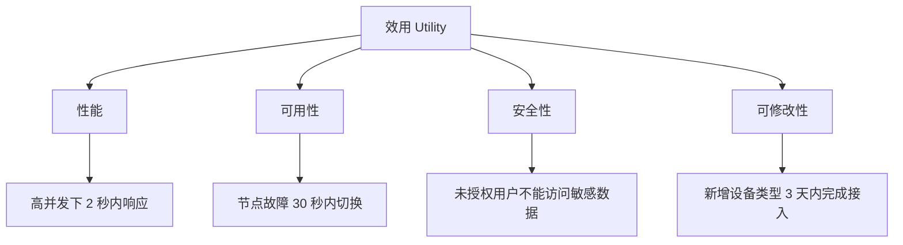

### 5.3 风险敏感权衡图

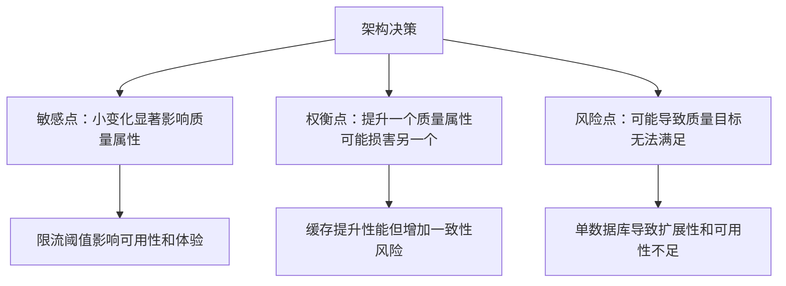

### 5.4 答题口令

```text
质量属性题先写场景六要素，再写效用树，最后找风险点、敏感点、权衡点。
```

### 5.5 必写 5 点

```text
1. 性能、可用性、安全性、可修改性是最常考质量属性。
2. 质量属性场景必须有刺激源、刺激、环境、制品、响应、响应度量。
3. 效用树从质量属性逐层细化到具体场景。
4. 敏感点是影响质量属性的关键参数或决策。
5. 权衡点是一个决策同时影响多个质量属性。
```

## 6. 第五优先级：DFD / UML / 架构图填空

### 6.1 DFD 图元素

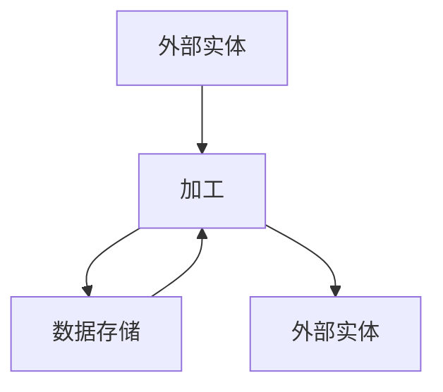

### 6.2 DFD 检查口诀

```text
外部实体在系统外；
加工必须有进有出；
数据存储不能直连外部实体；
父图子图输入输出要平衡。
```

### 6.3 UML 选择图

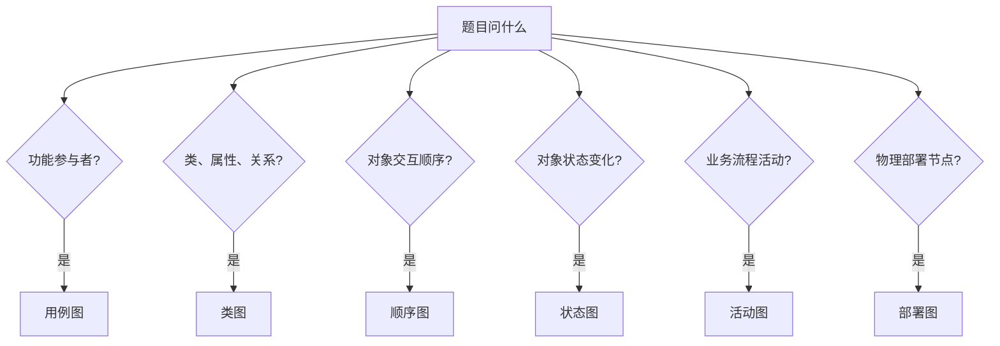

### 6.4 必写 5 点

```text
1. 用例图看参与者和系统功能。
2. 类图看类、属性、方法、关联、聚合、组合、继承。
3. 顺序图看对象生命线和消息顺序。
4. 状态图看状态、事件和迁移。
5. DFD 要检查父子图平衡和加工输入输出。
```

## 7. 第六优先级：嵌入式 / AUTOSAR / 边缘计算

### 7.1 AUTOSAR 分层图

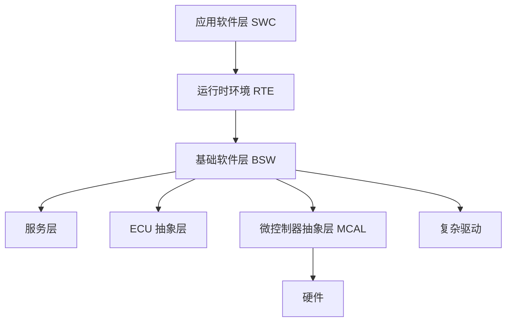

### 7.2 边缘计算图

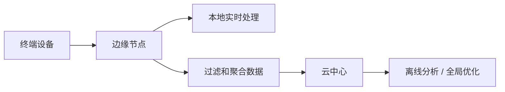

### 7.3 答题口令

```text
AUTOSAR 记三层：应用软件层、RTE、基础软件层。
边缘计算记四点：低延迟、少带宽、隐私保护、断网可用。
```

## 8. 最后一天背诵安排

```text
上午：
1 小时：RAG 流程和模板。
1 小时：缓存、读写分离、数据一致性。

下午：
1 小时：质量属性、效用树、风险敏感权衡点。
1 小时：云原生微服务和事件驱动。

晚上：
30 分钟：DFD/UML。
20 分钟：AUTOSAR/边缘计算。
20 分钟：默写 6 个答题口令。
```

## 9. 六个答题口令总表

```text
RAG：先治理知识，再混合检索，最后让大模型基于证据回答。
微服务：先按业务边界拆，再用网关和注册发现连，最后用事件驱动解耦。
缓存：读先查缓存，未命中查库并回填；写先改库，再删缓存。
质量属性：先写场景六要素，再写效用树，最后找风险点、敏感点、权衡点。
DFD/UML：先判断图类型，再检查元素关系和上下文平衡。
AUTOSAR：应用软件层、RTE、基础软件层，靠标准接口实现软硬件解耦。
```
