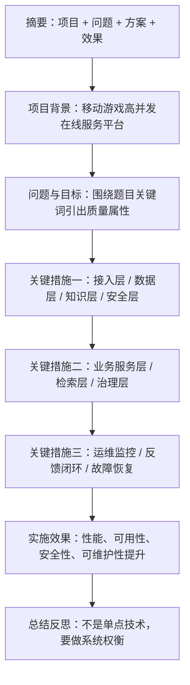
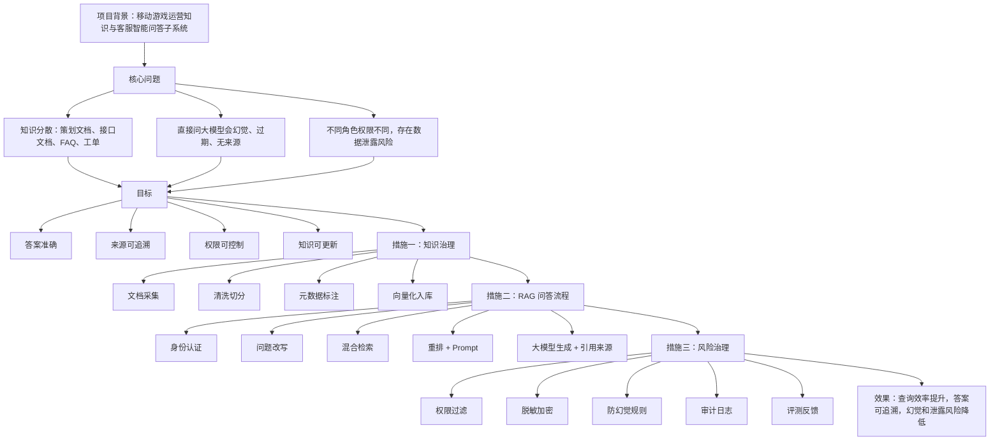
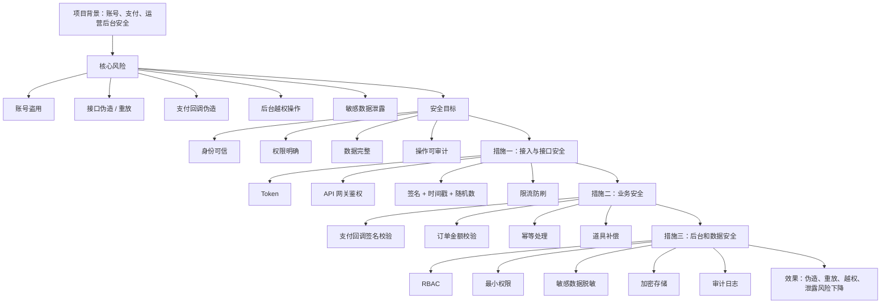
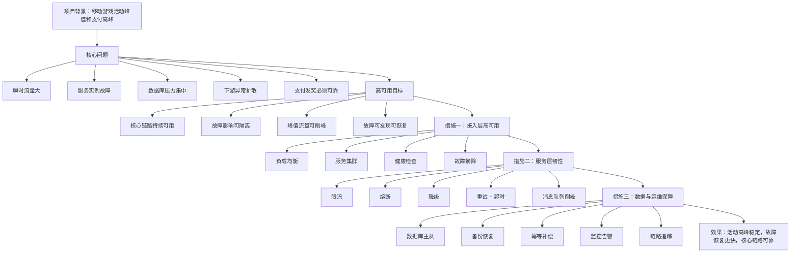
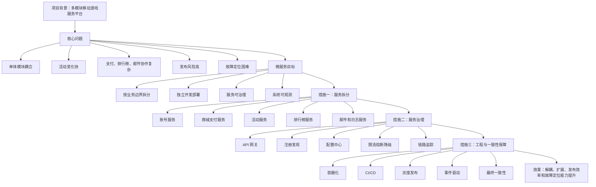

# 523论文结构图-考前速记

## 1. 总原则

后天考试，论文不要再逐字背全文。现在最有效的是背：

```text
项目背景固定
每题 3 个核心措施
每个措施 4 句话
最后统一总结
```

固定项目名：

```text
面向移动游戏的高并发在线服务平台
```

万能结构：

```text
摘要
-> 项目背景
-> 问题与目标
-> 关键措施一
-> 关键措施二
-> 关键措施三
-> 实施效果
-> 总结反思
```

## 2. 通用论文骨架图



## 3. 第一优先级：大模型 / RAG / 知识图谱

主论文：

[01_大模型RAG知识图谱_论基于大模型的智能问答系统架构设计_参考论文.md](01_大模型RAG知识图谱_论基于大模型的智能问答系统架构设计_参考论文.md)

### 3.1 结构图



### 3.2 三句话背法

```text
第一句：我们不是直接调用大模型，而是建设基于 RAG 的企业知识问答架构。
第二句：先做文档治理和向量化，再做混合检索、知识图谱校验和 Prompt 编排。
第三句：通过引用来源、权限过滤、脱敏审计和评测反馈，降低幻觉和数据泄露风险。
```

### 3.3 必背关键词

```text
RAG
文档解析
知识切分
元数据标注
向量数据库
语义检索
关键词检索
混合检索
知识图谱
实体关系
检索重排
Prompt 编排
模型网关
引用来源
幻觉治理
权限过滤
脱敏
审计
反馈闭环
```

### 3.4 考场改写

如果题目是：

```text
论人工智能技术在企业信息系统中的应用
```

就把标题改成：

```text
我们在移动游戏运营平台中引入人工智能技术，建设智能问答和知识服务能力。
```

如果题目是：

```text
论知识图谱与大模型融合
```

就强调：

```text
知识图谱用于表达游戏、活动、道具、支付、错误码和处理流程之间的关系，
大模型负责自然语言理解与答案生成。
```

## 4. 第二优先级：系统安全架构

主论文：

[02_系统安全架构_论系统安全架构设计_参考论文.md](02_系统安全架构_论系统安全架构设计_参考论文.md)

### 4.1 结构图



### 4.2 三句话背法

```text
第一句：安全架构不是单点校验，而是覆盖接入、业务、数据和运维全过程。
第二句：接入层做认证、鉴权、签名、防重放和限流，业务层重点保护支付和道具链路。
第三句：后台采用 RBAC 和最小权限，敏感数据脱敏加密，关键操作记录审计日志。
```

### 4.3 必背关键词

```text
身份认证
Token
API 网关
统一鉴权
接口签名
时间戳
随机数
防重放
RBAC
最小权限
支付回调校验
订单幂等
金额校验
敏感数据脱敏
传输加密
存储加密
日志审计
限流防刷
安全告警
```

### 4.4 考场改写

如果题目是：

```text
论零信任架构
```

就把安全目标改成：

```text
不默认信任任何用户、设备、客户端或内部服务，所有访问都必须认证、授权、校验和审计。
```

## 5. 第三优先级：高可用 / 可靠性 / 容错

主论文：

[03_高可用可靠性容错_论高可用架构设计_参考论文.md](03_高可用可靠性容错_论高可用架构设计_参考论文.md)

### 5.1 结构图



### 5.2 三句话背法

```text
第一句：高可用不是简单增加服务器，而是围绕核心链路建立冗余、隔离、削峰和恢复能力。
第二句：接入层用负载均衡、服务集群和健康检查，服务层用限流、熔断、降级和消息队列。
第三句：数据层用主从和备份恢复，支付发奖链路用幂等、补偿、监控和告警保障可靠性。
```

### 5.3 必背关键词

```text
服务集群
负载均衡
健康检查
故障摘除
限流
熔断
降级
重试
超时控制
消息队列
削峰填谷
幂等
补偿
数据库主从
备份恢复
监控告警
链路追踪
MTTR
错误率
接口成功率
```

### 5.4 考场改写

如果题目是：

```text
论系统可靠性设计
```

就把“高可用”替换为：

```text
系统在规定条件和规定时间内完成规定功能的能力。
```

多写：

```text
故障率、MTTR、接口成功率、补单率、消息失败率。
```

## 6. 第四优先级：微服务 / 服务治理 / 云原生

主论文：

[04_微服务服务治理云原生_论微服务架构及其应用_参考论文.md](04_微服务服务治理云原生_论微服务架构及其应用_参考论文.md)

### 6.1 结构图



### 6.2 三句话背法

```text
第一句：微服务不是拆得越细越好，而是按业务边界拆分，并配套治理和自动化能力。
第二句：我们将账号、商城、活动、排行榜、邮件、日志等模块拆分为独立服务。
第三句：通过网关、注册发现、配置中心、限流熔断、链路追踪、CI/CD 和事件驱动保障服务协作。
```

### 6.3 必背关键词

```text
服务拆分
业务边界
领域建模
独立部署
API 网关
服务注册与发现
配置中心
服务治理
接口契约
限流
熔断
降级
日志
指标
链路追踪
可观测性
容器化
Kubernetes
CI/CD
灰度发布
事件驱动
最终一致性
分布式事务
```

### 6.4 考场改写

如果题目是：

```text
论云原生架构及其应用
```

就把微服务目标升级为：

```text
服务化、弹性、可观测、韧性、全自动化、零信任、持续演进。
```

多写：

```text
容器化、Kubernetes、自动扩缩容、CI/CD、灰度发布、日志指标链路追踪。
```

## 7. 四题统一记忆口诀

```text
AI：先检索，再生成，防幻觉，控权限。
安全：先认证，再授权，签名防重放，审计可追踪。
高可用：先冗余，再隔离，限流熔断，监控恢复。
微服务：先拆分，再治理，自动发布，事件解耦。
```

## 8. 明天背诵安排

如果只有一天，建议这样背：

```text
上午 2 小时：背 AI/RAG 和安全。
下午 2 小时：背高可用和微服务。
晚上 1 小时：只背四个结构图和关键词。
睡前 20 分钟：默写四个主题的三句话背法。
```

每篇不要全文硬背。只要能默写：

```text
项目背景
核心问题
三个措施
实施效果
总结反思
```

就够考场展开成 2200～2800 字。
