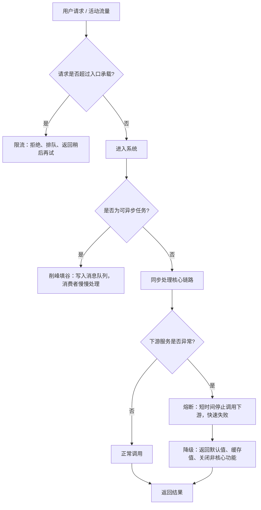

# 削峰填谷、限流、熔断、降级-概念讲解

## 1. 先给结论

这四个概念都属于高并发、高可用和系统韧性设计中的常用手段，但它们解决的问题不同。

一句话区分：

```text
削峰填谷：把瞬时高峰流量摊平，慢慢处理。
限流：超过系统承载能力的请求，先挡住一部分。
熔断：下游服务已经不稳定时，先停止继续调用它。
降级：系统压力大或依赖异常时，关闭非核心能力，保核心功能。
```

最重要的理解：

```text
削峰填谷解决“峰值太尖”；
限流解决“请求太多”；
熔断解决“下游坏了还一直调”；
降级解决“资源不够时优先保什么”。
```

## 2. 四者关系图



## 3. 削峰填谷

### 3.1 是什么

削峰填谷是指：

```text
当瞬时请求量很高时，不让所有请求同时压到后端系统，
而是通过队列、缓存、异步处理等方式把流量峰值削平，
在系统压力较低时再逐步处理积压任务。
```

通俗理解：

```text
高峰来了先排队，不要一起冲进数据库和核心服务。
```

### 3.2 解决什么问题

削峰填谷主要解决：

- 秒杀、活动、开服等瞬时高峰。
- 数据库写入压力过大。
- 下游服务处理能力有限。
- 非核心任务拖慢核心请求。
- 请求短时间集中到达，但可以稍后处理。

### 3.3 常用手段

常见方式：

```text
消息队列
异步任务
延迟队列
批量处理
任务调度
缓存预热
预约/排队
分批放量
```

最典型的是消息队列：

```text
请求进入系统
-> 写入消息队列
-> 快速返回“处理中”
-> 后台消费者按能力慢慢消费
-> 处理完成后更新状态或通知用户
```

### 3.4 游戏项目例子

例如限时活动开始时，大量玩家同时领奖。

如果同步处理：

```text
玩家请求 -> 活动服务 -> 背包服务 -> 邮件服务 -> 日志服务 -> 数据库
```

高峰时可能把数据库和背包服务打满。

使用削峰填谷：

```text
玩家请求 -> 校验资格 -> 写入领奖消息队列 -> 返回处理中
后台消费者 -> 发奖 -> 发邮件 -> 写日志
```

这样核心请求链路变短，数据库写入压力被摊平。

### 3.5 风险和注意点

削峰填谷不是免费能力，它会带来：

- 处理延迟。
- 队列积压。
- 消息重复。
- 消息丢失风险。
- 最终一致性问题。
- 用户需要查询处理状态。

必须配套：

```text
消息可靠投递
消费者幂等
失败重试
死信队列
补偿机制
队列积压监控
```

### 3.6 软考答题模板

```text
对于瞬时流量高但不要求同步完成的业务，可以采用削峰填谷策略。
将请求先写入消息队列或任务队列，由后台消费者按照系统处理能力异步消费，
避免高峰流量直接冲击数据库和下游服务。
同时需要设计消息可靠投递、幂等消费、失败重试、死信队列和队列积压监控，
以保证最终处理结果正确。
```

## 4. 限流

### 4.1 是什么

限流是指：

```text
限制单位时间内进入系统、服务、接口或资源的请求数量，
防止请求量超过系统承载能力。
```

通俗理解：

```text
系统最多每秒能处理 1000 个请求，那第 1001 个请求就不能无条件放进来。
```

### 4.2 解决什么问题

限流主要解决：

- 流量超过系统承载能力。
- 恶意刷接口。
- 热点接口被打爆。
- 下游服务被拖垮。
- 雪崩前需要保护核心系统。

### 4.3 限流位置

限流可以发生在多个位置：

| 位置 | 例子 |
|---|---|
| 客户端 | 按按钮频率限制，防止重复点击 |
| API 网关 | 按 IP、用户、接口、设备限流 |
| 服务端接口 | 限制某个业务接口 QPS |
| 下游调用 | 限制调用支付、短信、第三方服务频率 |
| 数据库/队列 | 限制写入速率或消费者并发 |

### 4.4 常用算法

#### 4.4.1 固定窗口

按固定时间窗口统计请求数。

例如：

```text
每 1 秒最多 1000 次请求。
```

优点：

- 简单。

缺点：

- 窗口边界可能出现突刺。

#### 4.4.2 滑动窗口

把时间窗口切成更细粒度的小窗口，滚动统计请求数。

优点：

- 比固定窗口平滑。

缺点：

- 实现稍复杂。

#### 4.4.3 漏桶算法

请求像水一样进入桶，以固定速率流出。

特点：

```text
强制平滑输出。
```

适合：

- 保护下游。
- 保持稳定处理速率。

#### 4.4.4 令牌桶算法

系统按固定速率生成令牌，请求必须拿到令牌才能通过。

特点：

```text
允许一定突发流量。
```

适合：

- 大多数 API 限流。
- 允许短暂突发但总体受控的场景。

#### 4.4.5 并发数限制

限制同时处理的请求数量。

例如：

```text
某接口最多同时处理 200 个请求。
```

适合：

- 慢接口。
- 数据库连接有限。
- 第三方服务调用。

### 4.5 限流后的处理方式

超过限流阈值后可以：

- 直接拒绝。
- 返回“系统繁忙，请稍后再试”。
- 排队等待。
- 降级返回缓存数据。
- 只允许 VIP 或核心请求通过。
- 进入异步队列。

### 4.6 游戏项目例子

例如礼包兑换接口被脚本刷。

可以按多个维度限流：

```text
同一用户每分钟最多请求 5 次。
同一设备每分钟最多请求 20 次。
同一 IP 每分钟最多请求 100 次。
整个礼包兑换接口每秒最多 2000 次。
```

这样可以避免恶意流量拖垮核心服务。

### 4.7 风险和注意点

限流要注意：

- 阈值太低会误伤正常用户。
- 阈值太高保护不了系统。
- 只按 IP 限流会受 NAT 影响。
- 限流结果要能被监控和告警。
- 核心接口和非核心接口阈值应不同。

### 4.8 软考答题模板

```text
当系统请求量可能超过承载能力时，可以在网关层、服务层或资源层进行限流。
限流可以按用户、IP、设备、接口和全局 QPS 等维度设置阈值，
常用算法包括固定窗口、滑动窗口、漏桶和令牌桶。
对于超过阈值的请求，可以返回稍后重试、进入排队队列或触发降级策略，
从而保护核心服务和数据库不被突发流量压垮。
```

## 5. 熔断

### 5.1 是什么

熔断是指：

```text
当下游服务持续超时、失败率过高或不可用时，
调用方暂时停止调用该下游服务，直接快速失败或返回降级结果，
避免故障继续扩散。
```

通俗理解：

```text
下游已经坏了，就不要每个请求都继续去等它超时。
```

熔断器类似电路保险丝：

```text
电流异常时断开电路；
服务异常时断开调用。
```

### 5.2 解决什么问题

熔断主要解决：

- 下游服务故障导致调用方线程被占满。
- 大量请求等待超时。
- 故障从一个服务扩散到整个系统。
- 级联故障。

### 5.3 熔断状态

熔断器通常有三种状态。

#### 5.3.1 关闭 Closed

正常状态。

```text
请求正常调用下游服务。
```

#### 5.3.2 打开 Open

熔断状态。

```text
请求不再调用下游，直接快速失败或返回降级结果。
```

触发条件可能是：

- 错误率超过阈值。
- 超时率超过阈值。
- 连续失败次数超过阈值。
- 平均响应时间过长。

#### 5.3.3 半开 Half-Open

探测恢复状态。

```text
允许少量请求尝试调用下游；
如果成功则关闭熔断；
如果失败则重新打开熔断。
```

### 5.4 游戏项目例子

例如支付查询服务异常。

如果不熔断：

```text
商城服务持续调用支付查询
-> 每次都超时
-> 商城服务线程被占满
-> 玩家购买、订单查询都变慢
```

使用熔断：

```text
支付查询错误率过高
-> 熔断器打开
-> 商城服务短时间不再调用支付查询
-> 返回“支付状态处理中，请稍后查看”
-> 后台任务继续补偿查询
```

这样支付查询故障不会拖垮商城服务。

### 5.5 熔断和限流的区别

| 对比项 | 限流 | 熔断 |
|---|---|---|
| 触发原因 | 请求太多 | 下游异常 |
| 保护对象 | 当前系统或资源 | 调用方和整体链路 |
| 处理方式 | 控制进入流量 | 暂停调用故障依赖 |
| 典型指标 | QPS、并发数 | 错误率、超时率、失败次数 |

### 5.6 软考答题模板

```text
当下游服务出现连续失败、超时或错误率升高时，可以采用熔断机制。
熔断器在正常状态下允许请求调用下游；当失败率超过阈值时进入打开状态，
短时间内直接返回失败或降级结果，避免请求继续阻塞在异常依赖上；
一段时间后进入半开状态，允许少量请求探测下游是否恢复。
熔断可以防止故障级联扩散，提高系统韧性。
```

## 6. 降级

### 6.1 是什么

降级是指：

```text
当系统压力过大、资源不足或依赖服务异常时，
主动关闭或简化部分非核心功能，
优先保证核心业务可用。
```

通俗理解：

```text
保命要紧，先保证核心链路能跑。
```

### 6.2 解决什么问题

降级主要解决：

- 系统资源不足。
- 下游依赖异常。
- 非核心功能拖慢核心功能。
- 高峰期必须保核心交易链路。
- 用户体验需要一个可接受的兜底结果。

### 6.3 常见降级方式

常见方式：

- 关闭非核心功能。
- 返回默认值。
- 返回缓存数据。
- 返回静态页面。
- 简化计算逻辑。
- 延迟处理。
- 只保留核心用户或核心业务。
- 关闭排行榜刷新、推荐、统计等辅助功能。

### 6.4 游戏项目例子

限时活动高峰时，可以降级：

```text
关闭实时排行榜刷新，改为每 1 分钟刷新。
关闭非核心运营统计实时写入，改为异步写入。
商城推荐位返回缓存数据。
邮件发送延迟处理。
只保证登录、支付、领奖、发奖等核心链路。
```

### 6.5 降级类型

#### 6.5.1 自动降级

系统根据指标自动触发。

指标包括：

- CPU 过高。
- 错误率升高。
- 响应时间过长。
- 队列积压。
- 下游不可用。

#### 6.5.2 手动降级

运维或开发在活动前或故障时手动开启降级开关。

例如：

```text
活动开始前关闭非核心统计。
支付通道异常时切换备用通道。
排行榜压力过高时降低刷新频率。
```

### 6.6 降级和熔断的区别

| 对比项 | 熔断 | 降级 |
|---|---|---|
| 核心动作 | 停止调用异常下游 | 提供简化或兜底能力 |
| 触发原因 | 下游失败率、超时率过高 | 系统压力大、资源不足、依赖异常 |
| 结果 | 快速失败或触发降级 | 返回默认值、缓存值、关闭非核心功能 |
| 关系 | 熔断后常常需要降级兜底 | 降级可以由熔断触发，也可以主动触发 |

### 6.7 软考答题模板

```text
当系统处于高峰压力或部分依赖不可用时，可以采用降级策略。
对非核心功能进行关闭、延迟或简化处理，例如返回缓存数据、默认值或静态结果，
优先保证登录、支付、下单、发奖等核心业务链路可用。
降级策略可以通过配置开关手动触发，也可以根据响应时间、错误率、CPU 和队列积压等指标自动触发。
```

## 7. 四者对比表

| 概念 | 解决的问题 | 常用手段 | 典型场景 | 核心风险 |
|---|---|---|---|---|
| 削峰填谷 | 瞬时高峰太尖 | 消息队列、异步任务、排队、批处理 | 秒杀、活动领奖、日志统计 | 延迟、积压、最终一致性 |
| 限流 | 请求超过承载能力 | 令牌桶、漏桶、滑动窗口、并发限制 | 登录、兑换码、支付、热门接口 | 误伤用户、阈值难设 |
| 熔断 | 下游异常拖垮调用方 | 熔断器、快速失败、半开探测 | 支付、短信、第三方服务异常 | 误熔断、恢复不及时 |
| 降级 | 压力大时保核心 | 默认值、缓存值、关闭非核心功能 | 活动高峰、依赖异常 | 用户体验下降、数据延迟 |

## 8. 一起使用的典型场景

以游戏限时活动为例：

```text
1. 活动开始前缓存预热，减少数据库压力。
2. 活动入口设置限流，超过阈值的请求返回稍后再试。
3. 活动领奖请求写入消息队列，进行削峰填谷。
4. 如果邮件服务异常，活动服务对邮件调用熔断。
5. 熔断后降级为“奖励处理中”，后续通过补偿任务发邮件。
6. 关闭非核心实时统计和实时排行榜刷新，优先保证领奖和发奖链路。
```

## 9. 常见考点

### 9.1 选择题考点

```text
削峰填谷常用消息队列。
限流常用令牌桶、漏桶、滑动窗口。
熔断用于下游异常时防止级联故障。
降级用于保核心功能、牺牲非核心功能。
熔断后通常需要降级兜底。
限流不是熔断，限流是流量太多，熔断是依赖异常。
削峰填谷会带来延迟和最终一致性问题。
```

### 9.2 案例题考点

常见问法：

```text
如何应对秒杀或活动高峰？
如何保护核心服务不被突发流量压垮？
如何防止下游服务异常导致雪崩？
如何保证核心链路在高峰期可用？
如何设计服务韧性？
```

答题组合：

```text
入口限流
消息队列削峰填谷
服务熔断
功能降级
幂等处理
失败重试
补偿机制
监控告警
```

### 9.3 论文可用表达

```text
在活动高峰场景下，我们没有让所有请求直接进入核心业务链路，而是在接入层设置限流策略，
对超过系统承载能力的请求返回稍后重试或进入排队队列。
对于发奖、邮件通知和日志统计等可异步处理的任务，通过消息队列进行削峰填谷，
由后台消费者按照处理能力逐步消费。
当支付、邮件等下游服务出现超时或错误率升高时，系统通过熔断机制快速失败，
避免故障扩散到上游服务。
同时，我们对非核心功能进行降级，例如降低排行榜刷新频率、延迟统计写入、返回缓存数据，
优先保证登录、支付、领奖和发奖等核心链路可用。
```

## 10. 快速记忆

### 10.1 四句话

```text
削峰填谷：排队慢慢做。
限流：太多不让进。
熔断：坏了先别调。
降级：保核心，舍非核心。
```

### 10.2 四个触发条件

```text
流量瞬时高峰 -> 削峰填谷。
请求超过阈值 -> 限流。
下游失败超时 -> 熔断。
资源不足或依赖异常 -> 降级。
```

### 10.3 四个常用技术

```text
削峰填谷：消息队列。
限流：令牌桶。
熔断：熔断器。
降级：开关 + 缓存兜底。
```

## 11. 考前最低掌握清单

```text
1. 削峰填谷是通过队列、异步和批处理把瞬时高峰摊平。
2. 限流是限制单位时间请求数或并发数，保护系统不被打垮。
3. 熔断是下游异常时暂时停止调用，防止级联故障。
4. 降级是关闭或简化非核心功能，优先保证核心链路。
5. 限流看 QPS 和并发数，熔断看错误率、超时率和失败次数。
6. 熔断后通常要配合降级，给用户返回缓存值、默认值或处理中。
7. 削峰填谷会带来延迟和最终一致性，需要幂等、重试、死信队列和补偿。
8. 高并发活动题可以组合回答：限流 + 削峰填谷 + 熔断 + 降级 + 监控告警。
```
