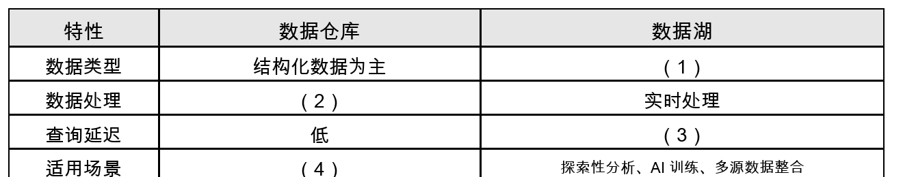

# 社交媒体平台数据架构-解题过程

## 题目原文

### 试题信息

```text
案例分析题：社交媒体平台数据架构
问题1：8分
问题2：5分
问题3：12分
合计：25分
```

### 说明原文

阅读以下关于某社交媒体平台数据架构的说明，回答下列问题。

某社交媒体公司需优化用户行为分析系统，支持每日 PB 级的用户点击流、评论和点赞数据。当前系统使用 Oracle 做数据库和数据仓库，但面临以下问题：

```text
（1）存储成本高：非结构化评论文本需占用大量结构化存储空间；
（2）数据延迟：用户行为分析需等待 ETL 完成，无法实时响应。
```

团队计划采用数据湖（如 Delta Lake 或者直接采用 HDFS）和图数据库（如 Neo4j）来替代关系数据库 Oracle。

### 问题原文

【问题 1】（8 分）

请比较数据仓库与数据湖在以下方面的差异，并填写表格。

【问题 2】（5 分）

在数据湖方案中，请说明 Delta Lake 相比传统 HDFS 哪个占有优势，并简单解释。

【问题 3】（12 分）

团队计划将用户社交关系数据从 Oracle 迁移至 Neo4j。请说明为何选择图数据库。

## 题图



题图说明：

```text
表格要求比较数据仓库与数据湖在数据类型、数据处理、查询延迟和适用场景方面的差异。
```

## 题目结论

### 问题 1

| 特性 | 数据仓库 | 数据湖 |
|---|---|---|
| 数据类型 | 结构化数据为主 | 结构化、半结构化、非结构化原始数据 |
| 数据处理 | ETL 批处理、离线处理 | 实时处理 |
| 查询延迟 | 低 | 较高 |
| 适用场景 | 固定报表、BI 分析、经营决策、结构化查询 | 探索性分析、AI 训练、多源数据整合 |

对应填空：

```text
（1）结构化、半结构化、非结构化原始数据
（2）ETL 批处理、离线处理
（3）较高
（4）固定报表、BI 分析、经营决策、结构化查询
```

### 问题 2

Delta Lake 相比传统 HDFS 的主要优势：

```text
支持 ACID 事务、Schema 管理、版本回溯、流批一体和更好的数据可靠性。
```

简答版：

```text
传统 HDFS 更像底层分布式文件系统，只负责存储文件；
Delta Lake 在数据湖上增加事务日志和表管理能力，可以保证数据一致性，
支持批处理和流处理统一，并能进行版本回溯和数据质量控制。
```

### 问题 3

选择 Neo4j 等图数据库的原因：

```text
社交关系天然是图结构，用户是节点，关注、好友、点赞、评论、转发等关系是边。
图数据库能高效处理多跳关系查询、好友推荐、共同好友、社区发现和传播路径分析，
避免关系数据库中大量 JOIN 带来的复杂度和性能问题。
```

## 问题 1 解题过程

### 1. 数据类型

数据仓库通常面向结构化数据。

典型数据包括：

```text
订单表
用户表
指标表
报表宽表
主题事实表
维度表
```

数据湖强调保存原始数据，既可以保存结构化数据，也可以保存半结构化和非结构化数据。

在本题中，社交媒体平台包含：

```text
点击流
评论文本
点赞数据
用户关系数据
```

其中评论文本属于非结构化数据，点击流也可能是日志、JSON 等半结构化数据。

所以：

```text
（1）结构化、半结构化、非结构化原始数据
```

### 2. 数据处理

数据仓库通常采用：

```text
ETL
离线批处理
先清洗建模后入库
```

即先 Extract、Transform、Load，再进行分析。

题目中说当前系统“用户行为分析需等待 ETL 完成，无法实时响应”，这正好说明传统数据仓库偏离线批处理。

所以：

```text
（2）ETL 批处理、离线处理
```

### 3. 查询延迟

数据仓库中的数据通常已经清洗、建模、索引或预聚合，适合固定报表和结构化查询，因此查询延迟低。

数据湖保存大量原始数据，数据类型复杂，查询前可能需要解析、清洗和转换。传统数据湖直接基于 HDFS 查询时，查询延迟通常较高。

注意：

```text
Delta Lake、湖仓一体、实时计算引擎可以降低延迟，
但与传统数据仓库对比时，数据湖一般填“较高”更符合表格逻辑。
```

所以：

```text
（3）较高
```

### 4. 适用场景

数据仓库适合结构化、稳定、口径明确的分析场景。

典型场景：

```text
BI 报表
经营分析
固定指标统计
历史趋势分析
决策支持
```

数据湖适合探索性分析、AI 训练和多源异构数据整合。

所以：

```text
（4）固定报表、BI 分析、经营决策、结构化查询
```

## 问题 2 解题过程

### 1. HDFS 的定位

HDFS 是分布式文件系统，主要解决海量文件的分布式存储问题。

它的优势是：

```text
高吞吐
可扩展
适合大文件存储
成本较低
```

但 HDFS 本身不直接提供完善的表级事务能力。

### 2. Delta Lake 的定位

Delta Lake 是数据湖表格式或湖仓增强方案。

它通常构建在对象存储或 HDFS 之上，通过事务日志增强数据湖能力。

主要优势：

```text
ACID 事务
Schema Enforcement
Schema Evolution
Time Travel
流批一体
数据版本管理
Upsert/Merge/Delete 支持
更可靠的数据一致性
```

### 3. 本题答法

可以这样答：

```text
Delta Lake 相比传统 HDFS 的优势在于，它不仅能存储海量数据，还提供 ACID 事务、元数据管理、
Schema 约束、版本回溯和流批一体处理能力。
传统 HDFS 主要是文件存储系统，缺少表级事务和版本管理。
因此在用户行为分析场景中，Delta Lake 更适合支撑实时或准实时分析，并能提高数据一致性和可靠性。
```

## 问题 3 解题过程

### 1. 社交关系天然适合图模型

社交媒体平台中的数据关系非常复杂。

可以建模为：

```text
用户 -> 节点
关注关系 -> 边
好友关系 -> 边
点赞关系 -> 边
评论关系 -> 边
转发关系 -> 边
群组关系 -> 边
```

图数据库把关系作为一等公民，适合表达用户之间的复杂连接。

### 2. 关系数据库处理社交关系的痛点

如果使用 Oracle 等关系数据库处理社交图，常见问题是：

```text
多跳关系查询需要大量 JOIN
共同好友、好友推荐查询复杂
关系链路越长，SQL 越复杂
查询性能下降明显
数据模型不够直观
```

例如：

```text
查询“我的好友的好友中，哪些人和我有共同兴趣”
```

在关系数据库中可能涉及用户表、好友表、兴趣表、行为表等多表关联。

### 3. 图数据库的优势

Neo4j 等图数据库适合处理：

```text
多跳关系查询
共同好友
好友推荐
社群发现
影响力分析
传播路径分析
反欺诈关系分析
兴趣圈层分析
```

核心优势：

```text
关系遍历效率高
模型直观
查询表达自然
适合深层关系分析
适合实时推荐和图算法
```

### 4. 本题答法

可以这样答：

```text
选择图数据库是因为用户社交关系天然是图结构，用户可以表示为节点，关注、好友、点赞、
评论和转发等行为可以表示为边。图数据库能够高效进行多跳关系遍历，适合共同好友查询、
好友推荐、社区发现、影响力分析和传播路径分析等场景。
相比关系数据库，图数据库避免了复杂的多表 JOIN，模型更直观，查询关系链路时性能更好，
因此适合社交媒体平台的关系数据分析。
```

## 最终背诵版

```text
数据仓库以结构化数据为主，采用 ETL 和离线批处理，查询延迟低，适合 BI 报表、经营分析和决策支持。
数据湖支持结构化、半结构化、非结构化原始数据，可支持实时处理，适合探索性分析、AI 训练和多源数据整合。
Delta Lake 相比传统 HDFS 的优势是增加 ACID 事务、Schema 管理、版本回溯和流批一体能力。
社交关系天然是图结构，图数据库将用户建模为节点，将关注、点赞、评论等关系建模为边，
适合多跳关系查询、好友推荐、共同好友、社区发现和传播路径分析，可避免关系数据库复杂 JOIN。
```

## 易错点

1. 数据湖不是只能存非结构化数据，而是能同时存结构化、半结构化和非结构化原始数据。
2. 数据仓库不是不能分析大数据，而是更适合清洗建模后的结构化分析。
3. HDFS 是分布式文件系统，Delta Lake 是在数据湖上增强事务和表管理能力。
4. 图数据库不是替代所有关系数据库，而是更适合关系密集、多跳遍历的场景。
5. Neo4j 适合社交关系分析，但交易、账务等强事务结构化场景仍可使用关系数据库。
