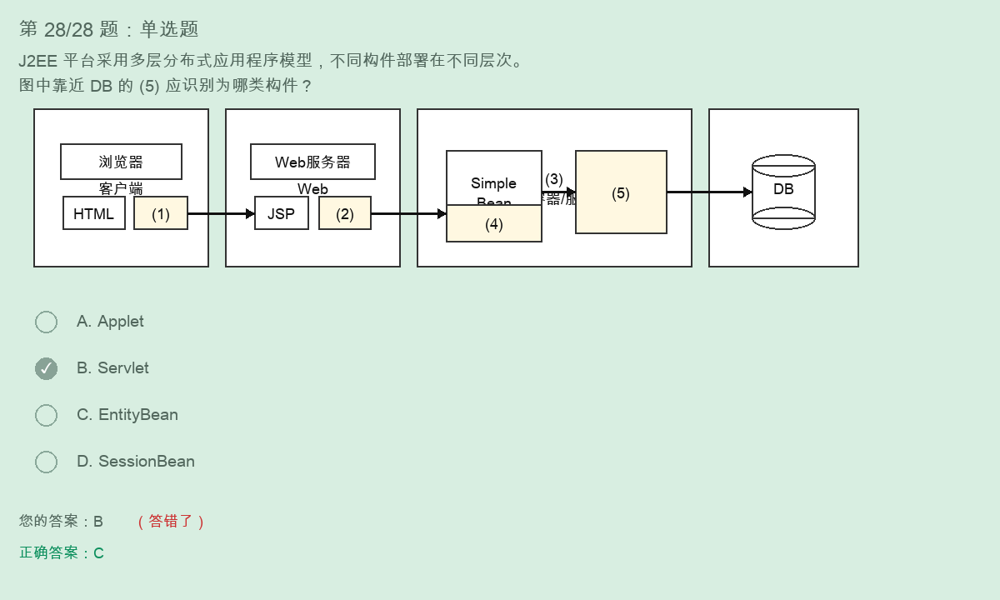

# J2EE多层分布式应用构件识别解题过程



## 题目

J2EE 平台采用了多层分布式应用程序模型，实现不同逻辑功能的应用程序被封装到不同的构件中，处于不同层次的构件可被分别部署到不同的机器中。图中的 1-5 分别为相关构件。

本题选项：

```text
A. Applet
B. Servlet
C. EntityBean
D. SessionBean
```

截图中：

```text
您的答案：B
正确答案：C
```

所以本题对应空应选：

```text
C. EntityBean
```

## J2EE 分层位置

典型 J2EE 多层结构：

```text
客户端层 -> Web 层 -> 业务/EJB 层 -> 数据库层
```

对应构件：

```text
客户端层：HTML、Applet
Web 层：JSP、Servlet
业务层：SessionBean、EntityBean
数据库层：DB
```

## 图中 1-5 的常见对应

结合图中位置判断：

```text
(1) Applet
(2) Servlet
(3) EJB 容器 / EJB 服务器
(4) SessionBean
(5) EntityBean
```

本题问到的正确选项是：

```text
(5) = EntityBean
```

## 为什么不是 Servlet

Servlet 的位置在：

```text
Web 层
```

它通常和 JSP 一起部署在 Web 容器 / Web 服务器中，负责接收请求、控制转发、调用业务逻辑。

图中 Servlet 对应的是：

```text
(2)
```

所以选 B 是把 Web 层构件误认为业务层/持久层构件。

## 为什么是 EntityBean

EntityBean 的位置在：

```text
EJB 层 / 业务层
靠近数据库
```

作用是：

```text
表示持久化业务对象
通常对应数据库中的数据
```

图中的 (5) 位于 EJB 层右侧，并且直接靠近 DB，因此它表示和数据库持久化数据相关的构件。

所以：

```text
(5) = EntityBean
答案 = C
```

## SessionBean 和 EntityBean 区分

SessionBean：

```text
表示业务过程 / 业务服务
处理业务逻辑
通常不直接表示数据库中的一条持久数据
```

EntityBean：

```text
表示持久化实体
和数据库记录关系更近
通常用于表示可持久保存的数据对象
```

记忆：

```text
SessionBean 管业务过程
EntityBean 管持久实体
```

## Applet、Servlet、Bean 快速区分

```text
Applet     -> 客户端，运行在浏览器/客户端
Servlet    -> Web 层，运行在 Web 容器
SessionBean -> EJB 层，处理业务逻辑
EntityBean  -> EJB 层，表示持久化实体，靠近数据库
```

## 最终背诵版

```text
J2EE 分层：
客户端层：HTML、Applet
Web 层：JSP、Servlet
EJB/业务层：SessionBean、EntityBean
数据库层：DB

看到靠近 DB 的 Bean，优先选 EntityBean。
看到 JSP 旁边的 Web 构件，优先选 Servlet。
```
