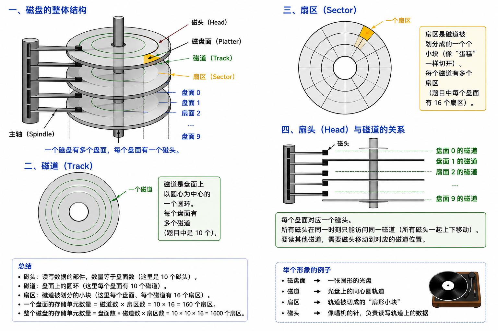

# 位图存储空间计算-快速记忆

## 原图



## 题目

一个磁盘有 `10` 个磁头、`10` 个磁道，每个盘面 `16` 个扇区，系统字长 `16` 位，问位图存储需要多少字节？

## 答案

```text
200 字节
```

## 一句话公式

```text
位图大小 = 磁盘块数 / 8 字节
```

如果题目强调“系统字长”，则用：

```text
位图字数 = 磁盘块数 / 系统字长
位图字节数 = 位图字数 * 每字字节数
```

## 本题速算

磁盘块数：

```text
磁头数 * 磁道数 * 每磁道扇区数
= 10 * 10 * 16
= 1600 个扇区
```

位图中：

```text
1 个扇区对应 1 bit
```

所以需要：

```text
1600 bit = 1600 / 8 = 200 Byte
```

也可以按系统字长算：

```text
系统字长 = 16 bit = 2 Byte
1600 / 16 = 100 个字
100 * 2 Byte = 200 Byte
```

## 最终背诵版

```text
位图：1 个磁盘块对应 1 bit。
磁盘块数 = 磁头数 * 磁道数 * 扇区数。
本题：10 * 10 * 16 = 1600 块。
1600 bit = 200 Byte。
```

## 易错点

```text
不要把“16 个扇区”当成 16 bit。
不要漏乘磁头数。
系统字长 16 bit 只是存储单位，结果仍然换算成字节。
如果不能整除系统字长，要向上取整；本题刚好整除。
```
