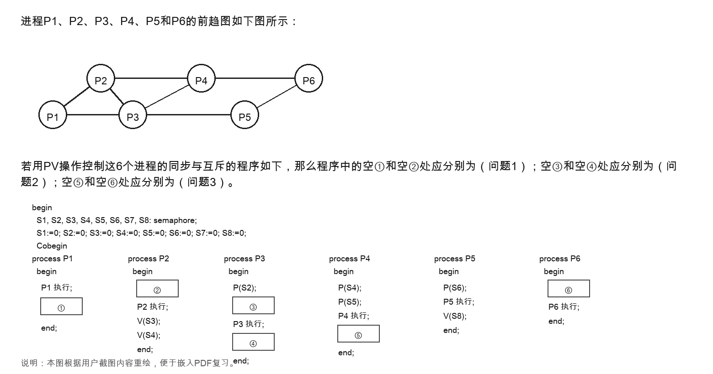
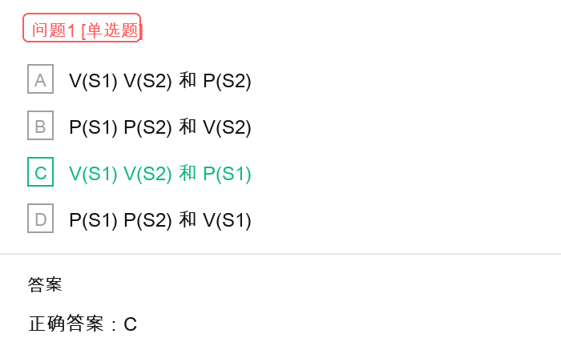
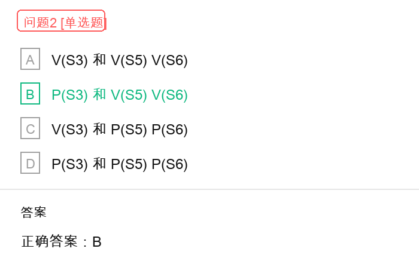
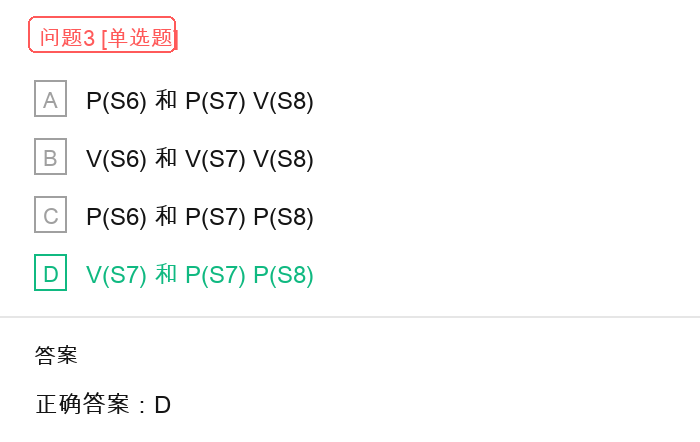

# 六进程前趋图与 PV 操作同步互斥解题过程

## 原题截图



## 问题 1 截图



## 问题 2 截图



## 问题 3 截图



## 题目结论

- 问题 1：空 `①` 和空 `②` 应分别填写 `V(S1) V(S2)` 和 `P(S1)`，选 `C`。
- 问题 2：空 `③` 和空 `④` 应分别填写 `P(S3)` 和 `V(S5) V(S6)`，选 `B`。
- 问题 3：空 `⑤` 和空 `⑥` 应分别填写 `V(S7)` 和 `P(S7) P(S8)`，选 `D`。

完整填空结果为：

```text
① = V(S1) V(S2)
② = P(S1)
③ = P(S3)
④ = V(S5) V(S6)
⑤ = V(S7)
⑥ = P(S7) P(S8)
```

## 核心规则

用 PV 操作表达前趋关系时，记住下面四句话：

```text
前驱发信号 -> V(S)
后继等信号 -> P(S)
每个前趋关系对应一个信号量
同一题中的信号量绑定关系不能交叉使用
```

如果存在前趋关系：

```text
A -> B
```

则应写成：

```text
A 执行完后：V(S)
B 执行前：  P(S)
```

其中：

- `P(S)`：申请信号量。如果信号量不足，则进程阻塞等待。
- `V(S)`：释放信号量。表示某个前驱条件已经完成，可以通知后继进程继续执行。
- 本题中 `S1` 到 `S8` 的初值均为 `0`，所以所有后继进程都必须等到对应前驱执行完并执行 `V` 操作后，才能通过 `P` 操作继续执行。

## 第一步：从前趋图提取前趋关系

根据题图，6 个进程之间共有 8 条前趋边：

```text
P1 -> P2
P1 -> P3
P2 -> P3
P2 -> P4
P3 -> P4
P3 -> P5
P4 -> P6
P5 -> P6
```

题目正好给出 8 个信号量 `S1` 到 `S8`，因此可以为每一条前趋边绑定一个信号量。

## 第二步：确定 S1 到 S8 的绑定关系

结合题目中已经给出的 PV 操作，可以得到以下绑定关系：

```text
S1：P1 -> P2
S2：P1 -> P3
S3：P2 -> P3
S4：P2 -> P4
S5：P3 -> P4
S6：P3 -> P5
S7：P4 -> P6
S8：P5 -> P6
```

这个绑定关系一旦确定，后面就不能交叉使用。例如，`S2` 已经表示 `P1 -> P3`，就不能再拿去表示 `P1 -> P2` 或其他前趋关系。

## 第三步：分析 P1 和 P2，求空 ① 和空 ②

### P1 的操作

`P1` 是 `P2` 和 `P3` 的前驱：

```text
P1 -> P2 使用 S1
P1 -> P3 使用 S2
```

所以 `P1` 执行完后，要释放 `S1` 和 `S2`：

```text
① = V(S1) V(S2)
```

### P2 的操作

`P2` 的前驱是 `P1`：

```text
P1 -> P2 使用 S1
```

所以 `P2` 执行前必须等待 `S1`：

```text
② = P(S1)
```

同时题目中已经给出 `P2` 执行后有：

```text
V(S3)
V(S4)
```

说明 `P2` 又分别是 `P3` 和 `P4` 的前驱。

因此，问题 1 选择：

```text
C：V(S1) V(S2) 和 P(S1)
```

## 第四步：分析 P3，求空 ③ 和空 ④

`P3` 有两个前驱：`P1` 和 `P2`。

其中题目中已经给出 `P3` 执行前有：

```text
P(S2)
```

这表示 `P3` 要等待 `P1` 完成。

此外，`P3` 还必须等待 `P2` 完成：

```text
P2 -> P3 使用 S3
```

所以空 `③` 应填写：

```text
③ = P(S3)
```

`P3` 执行完成后，又是 `P4` 和 `P5` 的前驱：

```text
P3 -> P4 使用 S5
P3 -> P5 使用 S6
```

所以空 `④` 应填写：

```text
④ = V(S5) V(S6)
```

因此，问题 2 选择：

```text
B：P(S3) 和 V(S5) V(S6)
```

## 第五步：分析 P4、P5 和 P6，求空 ⑤ 和空 ⑥

### P4 的操作

`P4` 有两个前驱：`P2` 和 `P3`。

题目中已经给出：

```text
P(S4)
P(S5)
```

这正好表示：

```text
P2 -> P4 使用 S4
P3 -> P4 使用 S5
```

`P4` 执行完成后，是 `P6` 的前驱：

```text
P4 -> P6 使用 S7
```

所以空 `⑤` 应填写：

```text
⑤ = V(S7)
```

### P5 的操作

`P5` 的前驱是 `P3`，题目中已经给出：

```text
P(S6)
```

表示 `P5` 要等待 `P3` 完成。

`P5` 执行完成后，题目中已经给出：

```text
V(S8)
```

表示 `P5` 是 `P6` 的前驱。

### P6 的操作

`P6` 有两个前驱：`P4` 和 `P5`。

```text
P4 -> P6 使用 S7
P5 -> P6 使用 S8
```

所以 `P6` 执行前必须等待 `S7` 和 `S8`：

```text
⑥ = P(S7) P(S8)
```

因此，问题 3 选择：

```text
D：V(S7) 和 P(S7) P(S8)
```

## 最终 PV 程序结构

整理后，完整 PV 程序逻辑如下：

```text
P1:
  P1 执行
  V(S1)
  V(S2)

P2:
  P(S1)
  P2 执行
  V(S3)
  V(S4)

P3:
  P(S2)
  P(S3)
  P3 执行
  V(S5)
  V(S6)

P4:
  P(S4)
  P(S5)
  P4 执行
  V(S7)

P5:
  P(S6)
  P5 执行
  V(S8)

P6:
  P(S7)
  P(S8)
  P6 执行
```

## 易错点

1. `P1` 是前驱进程，所以执行完后应该写 `V(S1) V(S2)`，不是 `P(S1) P(S2)`。
2. `P2` 的前驱是 `P1`，所以 `P2` 执行前应写 `P(S1)`。
3. `P3` 有两个前驱：`P1` 和 `P2`，所以它必须等待 `S2` 和 `S3`。
4. `P4` 有两个前驱：`P2` 和 `P3`，所以它必须等待 `S4` 和 `S5`。
5. `P6` 有两个前驱：`P4` 和 `P5`，所以它必须等待 `S7` 和 `S8`。
6. 信号量不是按编号顺序随便使用，而是按题目程序和前趋图确定的绑定关系使用。
