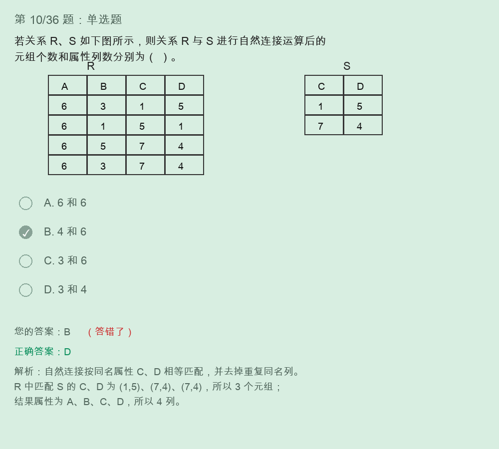

# 关系代数自然连接与投影解题过程



## 题目

若关系 R、S 如图所示，则关系 R 与 S 进行自然连接运算后的元组个数和属性列数分别为（ ）。

关系 R：

```text
A  B  C  D
6  3  1  5
6  1  5  1
6  5  7  4
6  3  7  4
```

关系 S：

```text
C  D
1  5
7  4
```

选项：

```text
A. 6 和 6
B. 4 和 6
C. 3 和 6
D. 3 和 4
```

正确答案：

```text
D. 3 和 4
```

## 自然连接规则

自然连接 R ⋈ S 的规则：

```text
1. 找出两个关系中的同名属性。
2. 只保留同名属性取值相等的元组组合。
3. 结果中去掉重复的同名属性列。
```

本题中：

```text
R(A, B, C, D)
S(C, D)
```

同名属性是：

```text
C、D
```

所以连接条件是：

```text
R.C = S.C
R.D = S.D
```

## 逐行匹配

关系 S 中有两组 C、D：

```text
(1, 5)
(7, 4)
```

检查 R 的每一行：

```text
R 第1行：C,D = (1,5)  匹配 S 第1行，保留
R 第2行：C,D = (5,1)  不匹配，删除
R 第3行：C,D = (7,4)  匹配 S 第2行，保留
R 第4行：C,D = (7,4)  匹配 S 第2行，保留
```

所以自然连接后的元组数：

```text
3
```

## 属性列数

自然连接会去掉重复的同名属性列。

原关系：

```text
R 有 4 列：A、B、C、D
S 有 2 列：C、D
```

如果是笛卡尔积：

```text
列数 = 4 + 2 = 6
```

但自然连接要把 S 中重复的 C、D 去掉，所以结果属性为：

```text
A、B、C、D
```

属性列数：

```text
4
```

因此最终结果：

```text
元组数 = 3
属性列数 = 4
答案 = D
```

## 自然连接结果

自然连接 R ⋈ S 后的结果可以写成：

```text
A  B  C  D
6  3  1  5
6  5  7  4
6  3  7  4
```

## 和笛卡尔积的区别

本题最容易把自然连接错看成笛卡尔积。

```text
笛卡尔积：
R 有 4 行，S 有 2 行
结果元组数 = 4 × 2 = 8
结果属性列数 = 4 + 2 = 6
```

自然连接：

```text
只保留 C、D 相等的行
并去掉重复的 C、D 列
```

所以不是：

```text
6 和 6
4 和 6
3 和 6
```

而是：

```text
3 和 4
```

## 关系代数表达式补充

截图题干还出现了类似：

```text
π1,4(σ3=6(R×S))
```

读法：

```text
R×S：先做笛卡尔积
σ3=6：选择第 3 列等于第 6 列的行
π1,4：最后只保留第 1 列和第 4 列
```

对 R×S 的列编号：

```text
1  2  3  4  5  6
A  B  C  D  C  D
```

注意：

```text
σ 是选行
π 是选列
× 是所有组合
⋈ 是按同名属性相等连接并去重列
```

## 最终背诵版

```text
自然连接三步：
找同名列，按同名列相等匹配，去掉重复同名列。

本题：
同名列是 C、D。
R 中匹配 (1,5)、(7,4)、(7,4)，所以元组数 3。
结果列只保留 A、B、C、D，所以列数 4。
答案 D。
```
