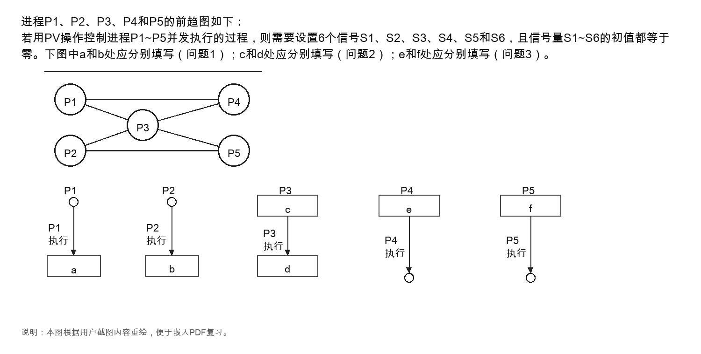
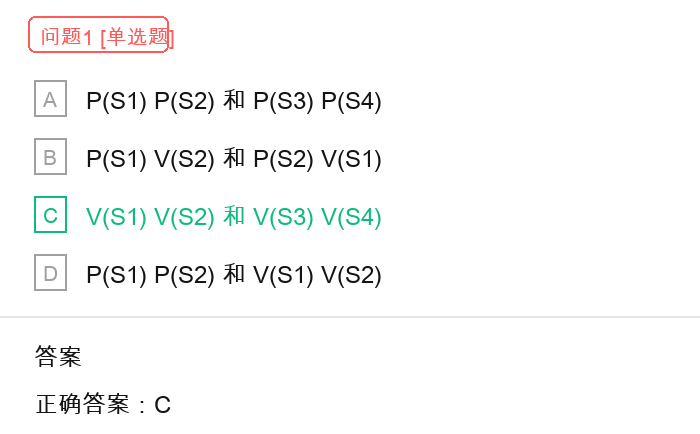
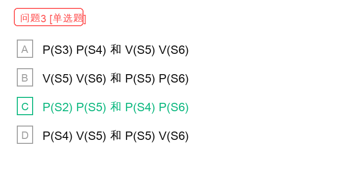

# 前趋图与 PV 操作控制并发执行解题过程

## 原题截图



## 问题 1 截图



## 问题 2 截图


## 问题 3 截图



## 题目结论

- 问题 1：`a` 和 `b` 处应分别填写 `V(S1) V(S2)` 和 `V(S3) V(S4)`，选 `C`。
- 问题 2：`c` 和 `d` 处应分别填写 `P(S1) P(S3)` 和 `V(S5) V(S6)`，选 `B`。
- 问题 3：`e` 和 `f` 处应分别填写 `P(S2) P(S5)` 和 `P(S4) P(S6)`，选 `C`。

## 核心规则

PV 操作用来表达进程之间的前趋约束时，可以按下面规则处理：

```text
若存在前趋关系：A -> B
则 A 执行完后执行 V(S)
   B 执行前先执行 P(S)
```

其中：

- `P(S)`：申请信号量。若信号量不足，则进程阻塞等待。
- `V(S)`：释放信号量。表示某个前驱条件已经满足。
- 本题中 `S1` 到 `S6` 初值均为 `0`，因此后继进程必须等待前驱进程执行完并释放信号量后，才能继续执行。

可以进一步记成四句话：

```text
前驱发信号 -> V(S)
后继等信号 -> P(S)
每个前趋关系对应一个信号量
同一题中的信号量绑定关系不能交叉使用
```

这里要特别注意，`P` 和 `V` 不是按进程名字随便配对，而是按“前趋边”配对。某个信号量一旦表示了一条前趋关系，在后面就必须一直按这条关系使用。

## 第一步：从前趋图提取约束关系

根据题图，进程之间共有 6 条前趋边：

```text
P1 -> P3
P1 -> P4
P2 -> P3
P2 -> P5
P3 -> P4
P3 -> P5
```

题目正好要求设置 6 个信号量，因此可以为每一条前趋边分配一个信号量。

## 第二步：为每条前趋边分配信号量

一种自然的分配方式如下：

```text
S1：P1 -> P3
S2：P1 -> P4
S3：P2 -> P3
S4：P2 -> P5
S5：P3 -> P4
S6：P3 -> P5
```

这个分配与选项中的表达保持一致。

## 关键防错：为什么 S2 不是给 P3 的

从上面的绑定关系可以看到：

```text
S1：P1 -> P3
S2：P1 -> P4
```

也就是说，`S2` 已经绑定的是 `P1 -> P4` 这条前趋关系。它表示的是：`P4` 必须等待 `P1` 完成。

因此，`S2` 不能再拿给 `P3` 使用。如果让 `P3` 执行 `P(S2)`，含义就变成了：

```text
P3 等待 P1 -> P4 这条关系对应的信号
```

这样会把 `P3` 错误地绑定到 `P4` 的等待条件上，导致同步逻辑混乱。按题目给定的信号量分配，`P3` 的两个前驱是 `P1` 和 `P2`，所以它只能等待：

```text
P1 -> P3 对应的 S1
P2 -> P3 对应的 S3
```

因此，`P3` 执行前应写：

```text
P(S1) P(S3)
```

不能写成：

```text
P(S1) P(S2)
```

## 第三步：确定每个进程的 PV 操作

### P1 的操作

`P1` 是 `P3` 和 `P4` 的前驱。

```text
P1 -> P3 使用 S1
P1 -> P4 使用 S2
```

因此，`P1` 执行完后要释放 `S1` 和 `S2`：

```text
a = V(S1) V(S2)
```

### P2 的操作

`P2` 是 `P3` 和 `P5` 的前驱。

```text
P2 -> P3 使用 S3
P2 -> P5 使用 S4
```

因此，`P2` 执行完后要释放 `S3` 和 `S4`：

```text
b = V(S3) V(S4)
```

所以问题 1 选择：

```text
C：V(S1) V(S2) 和 V(S3) V(S4)
```

## 第四步：分析 P3 的等待与释放

`P3` 的前驱是 `P1` 和 `P2`。

```text
P1 -> P3 使用 S1
P2 -> P3 使用 S3
```

因此，`P3` 执行前必须等待 `S1` 和 `S3`：

```text
c = P(S1) P(S3)
```

同时，`P3` 又是 `P4` 和 `P5` 的前驱。

```text
P3 -> P4 使用 S5
P3 -> P5 使用 S6
```

因此，`P3` 执行完后要释放 `S5` 和 `S6`：

```text
d = V(S5) V(S6)
```

所以问题 2 选择：

```text
B：P(S1) P(S3) 和 V(S5) V(S6)
```

## 第五步：分析 P4 和 P5 的等待条件

### P4 的等待条件

`P4` 的前驱是 `P1` 和 `P3`。

```text
P1 -> P4 使用 S2
P3 -> P4 使用 S5
```

因此，`P4` 执行前必须等待 `S2` 和 `S5`：

```text
e = P(S2) P(S5)
```

### P5 的等待条件

`P5` 的前驱是 `P2` 和 `P3`。

```text
P2 -> P5 使用 S4
P3 -> P5 使用 S6
```

因此，`P5` 执行前必须等待 `S4` 和 `S6`：

```text
f = P(S4) P(S6)
```

所以问题 3 选择：

```text
C：P(S2) P(S5) 和 P(S4) P(S6)
```

## 最终 PV 程序结构

整理后，各进程的 PV 操作如下：

```text
P1:
  P1 执行
  V(S1)
  V(S2)

P2:
  P2 执行
  V(S3)
  V(S4)

P3:
  P(S1)
  P(S3)
  P3 执行
  V(S5)
  V(S6)

P4:
  P(S2)
  P(S5)
  P4 执行

P5:
  P(S4)
  P(S6)
  P5 执行
```

## 易错点

1. 前驱进程执行完后应该执行 `V` 操作，而不是 `P` 操作。
2. 后继进程执行前应该执行 `P` 操作，用来等待前驱完成。
3. 一个进程如果有多个前驱，就必须执行多个 `P` 操作，等所有前驱条件都满足后才能执行。
4. 一个进程如果有多个后继，就必须执行多个 `V` 操作，分别通知每个后继。
5. 本题不要只看进程位置，要先从前趋图抽取边，再把每条边映射为一个信号量。
