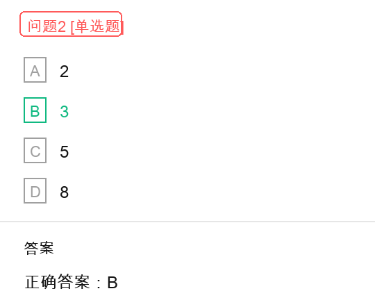

# 按字节编址内存容量与芯片片数解题过程

## 原题截图


## 问题 1 截图


## 问题 2 截图



## 题目结论

- 地址范围 `A0000H` 到 `CFFFFH` 的内存共有 `192K` 字节，问题 1 选 `D`。
- 若用容量为 `64K * 8bit` 的存储器芯片构成该内存空间，至少需要 `3` 片，问题 2 选 `B`。

## 已知条件

题目给出：

- 内存按字节编址。
- 起始地址为 `A0000H`。
- 结束地址为 `CFFFFH`。
- 存储器芯片容量为 `64K * 8bit`。

## 第一步：理解“按字节编址”

按字节编址表示：

```text
1 个地址编号对应 1 个字节
```

所以要求地址范围内共有多少字节，本质上就是求这个地址范围内有多少个地址单元。

地址范围包含起始地址和结束地址，因此计算公式是：

```text
容量 = 结束地址 - 起始地址 + 1
```

不能漏掉最后的 `+1`。

## 第二步：计算地址范围大小

题目地址范围为：

```text
A0000H ~ CFFFFH
```

代入公式：

```text
CFFFFH - A0000H + 1
```

先计算：

```text
CFFFFH - A0000H = 2FFFFH
```

再加 1：

```text
2FFFFH + 1 = 30000H
```

因此，该地址范围共有：

```text
30000H 字节
```

## 第三步：把 30000H 换算成 KB

十六进制：

```text
30000H = 3 * 10000H
```

而：

```text
10000H = 65536 字节 = 64KB
```

所以：

```text
30000H = 3 * 64KB = 192KB
```

由于题目问“共有多少字节”，选项用 `K` 表示，因此答案为：

```text
192K 字节
```

问题 1 选择：

```text
D：192k
```

## 第四步：计算每片芯片容量

芯片容量为：

```text
64K * 8bit
```

含义是：

```text
64K 个存储单元，每个存储单元宽度为 8bit
```

因为：

```text
8bit = 1Byte
```

所以每片芯片容量为：

```text
64K * 8bit = 64KByte = 64KB
```

## 第五步：计算需要多少片芯片

目标内存空间大小为：

```text
192KB
```

每片芯片容量为：

```text
64KB
```

需要芯片片数为：

```text
192KB / 64KB = 3
```

问题 2 选择：

```text
B：3
```

## 最终答案

```text
地址范围 A0000H ~ CFFFFH 的内存容量：192K 字节
至少需要的 64K * 8bit 存储器芯片片数：3 片
```

## 易错点

1. 地址范围是闭区间，必须计算 `结束地址 - 起始地址 + 1`。
2. `CFFFFH - A0000H = 2FFFFH` 不是最终容量，还要再加 `1`，得到 `30000H`。
3. `30000H = 192KB`，不是 `160KB` 或 `96KB`。
4. `64K * 8bit` 表示 `64K` 个 `8bit` 存储单元，也就是 `64KB`，不是 `64Kbit`。
