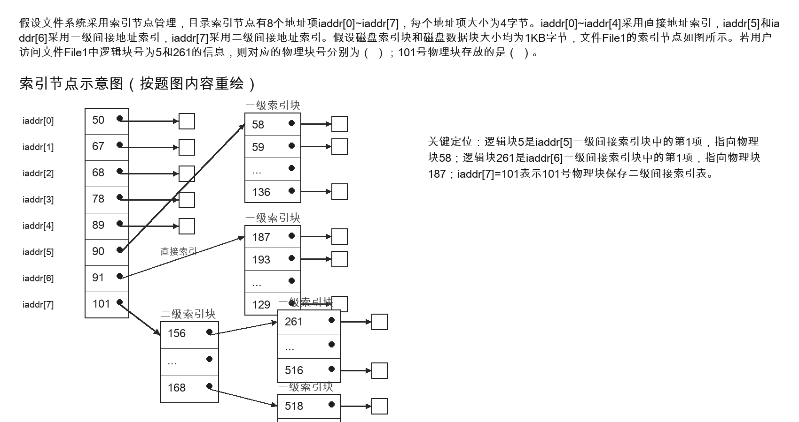
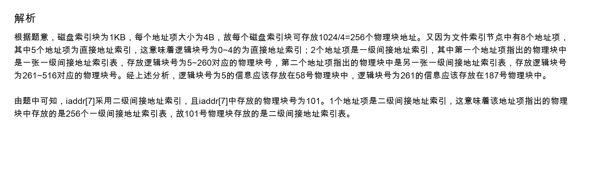

# 索引节点地址转换解题过程

## 原题截图



## 参考答案截图



## 题目结论

- 文件 File1 中逻辑块号为 `5` 的信息，对应的物理块号是 `58`。
- 文件 File1 中逻辑块号为 `261` 的信息，对应的物理块号是 `187`。
- `101` 号物理块中存放的是二级间接地址索引表。

## 已知条件

题目给出：

- 文件系统采用索引节点管理。
- 目标索引节点有 8 个地址项：`iaddr[0]` 到 `iaddr[7]`。
- 每个地址项大小为 `4B`。
- `iaddr[0]` 到 `iaddr[4]` 采用直接地址索引。
- `iaddr[5]`、`iaddr[6]` 采用一级间接地址索引。
- `iaddr[7]` 采用二级间接地址索引。
- 磁盘索引块大小为 `1KB`。
- 磁盘数据块大小为 `1KB`。

## 第一步：计算一个索引块能存多少个地址

磁盘索引块大小为 `1KB = 1024B`，每个地址项大小为 `4B`。

因此，一个索引块可以存放的地址项数量为：

```text
1024 / 4 = 256
```

也就是说，一个一级间接地址索引块可以指向 `256` 个数据块。

## 第二步：划分逻辑块号范围

### 直接地址索引

`iaddr[0]` 到 `iaddr[4]` 是直接地址索引，共 5 个地址项。

因此：

```text
逻辑块 0 -> iaddr[0]
逻辑块 1 -> iaddr[1]
逻辑块 2 -> iaddr[2]
逻辑块 3 -> iaddr[3]
逻辑块 4 -> iaddr[4]
```

所以逻辑块号 `0` 到 `4` 使用直接地址索引。

### 第一个一级间接地址索引

`iaddr[5]` 是一级间接地址索引。

它本身不直接指向数据块，而是指向一个索引块。该索引块中有 `256` 个地址项，每个地址项再指向一个数据块。

由于前 5 个逻辑块已经由直接地址索引表示，所以 `iaddr[5]` 覆盖：

```text
逻辑块 5 ~ 260
```

计算方式：

```text
起始逻辑块号 = 5
结束逻辑块号 = 5 + 256 - 1 = 260
```

### 第二个一级间接地址索引

`iaddr[6]` 也是一级间接地址索引。

它继续覆盖后面的 256 个逻辑块：

```text
逻辑块 261 ~ 516
```

计算方式：

```text
起始逻辑块号 = 261
结束逻辑块号 = 261 + 256 - 1 = 516
```

### 二级间接地址索引

`iaddr[7]` 是二级间接地址索引。

它指向的物理块不是数据块，也不是直接的数据块地址表，而是一张二级间接地址索引表。该表中的每个地址项再指向一个一级间接地址索引块。

因此，图中 `iaddr[7] = 101` 表示：

```text
101 号物理块中存放的是二级间接地址索引表
```

## 第三步：求逻辑块 5 的物理块号

逻辑块号 `5` 属于第一个一级间接地址索引范围：

```text
iaddr[5] 覆盖逻辑块 5 ~ 260
```

逻辑块 `5` 是该范围内的第 `1` 个逻辑块，也就是 `iaddr[5]` 所指向索引块中的第 `1` 个地址项。

根据题图，该地址项指向的物理块号为：

```text
58
```

所以：

```text
逻辑块 5 -> 物理块 58
```

## 第四步：求逻辑块 261 的物理块号

逻辑块号 `261` 属于第二个一级间接地址索引范围：

```text
iaddr[6] 覆盖逻辑块 261 ~ 516
```

逻辑块 `261` 是该范围内的第 `1` 个逻辑块，也就是 `iaddr[6]` 所指向索引块中的第 `1` 个地址项。

根据题图，该地址项指向的物理块号为：

```text
187
```

所以：

```text
逻辑块 261 -> 物理块 187
```

## 答案

```text
逻辑块号 5   对应的物理块号：58
逻辑块号 261 对应的物理块号：187
101 号物理块中存放的是：二级间接地址索引表
```

## 易错点

1. 不要把 `iaddr[5]`、`iaddr[6]` 中的值当作数据块号。它们是一级间接索引块的物理块号。
2. 一个索引块能存放多少个地址项，要用“索引块大小 / 地址项大小”计算，即 `1024 / 4 = 256`。
3. 直接索引有 5 项，所以逻辑块号从 `0` 到 `4` 才是直接索引，逻辑块号 `5` 已经进入一级间接索引。
4. `iaddr[7]` 是二级间接索引，因此 `101` 号物理块中存放的是索引表，不是文件数据。
