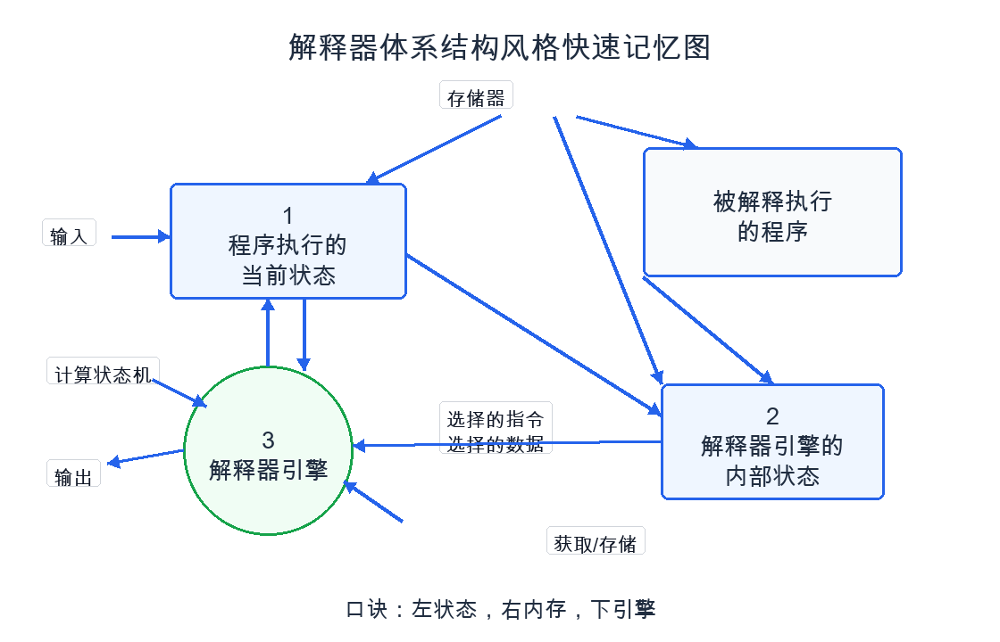

# 解释器体系结构风格-快速记忆

## 一句话结论

```text
解释器 = 引擎按程序，一边看当前执行状态，一边维护内部状态。
```

## 本题答案

```text
1：程序执行的当前状态
2：解释器引擎的内部状态
3：解释器引擎
```

## 快速口诀

```text
左状态，右内存，下引擎。
```

解释：

- 左边接输入、输出、计算状态机，所以是程序执行的当前状态。
- 右边靠近被解释执行的程序，还涉及选择指令、选择数据、获取/存储，所以是解释器引擎的内部状态。
- 下面圆形像发动机，真正执行解释动作，所以是解释器引擎。

## 复习图



## 看图判断法

### 第一步：先找“被解释执行的程序”

题图里只要出现：

```text
被解释执行的程序
程序
脚本
规则
DSL
Python代码
流程定义
```

基本就是解释器风格。

### 第二步：再找“谁真正干活”

真正干活的是解释器引擎。

关键词：

```text
选择指令
选择数据
解释执行
获取/存储
状态转换
```

这些箭头通常指向或来自解释器引擎。

### 第三步：区分两个状态

```text
程序执行的当前状态：程序运行到哪里、当前上下文是什么。
解释器引擎的内部状态：解释器自己保存的执行信息、指令选择、数据选择、内部控制信息。
```

## 易混点

### 1 和 2 的区别

```text
1 关注“程序执行到哪一步”。
2 关注“解释器自己怎么执行”。
```

记法：

```text
程序状态看外部输入输出；
引擎状态看内部取数取指。
```

### 解释器引擎和被解释程序的区别

```text
被解释程序：被执行的对象。
解释器引擎：执行这个对象的工具。
```

类比：

```text
Python脚本 = 被解释执行的程序
Python解释器 = 解释器引擎
运行时上下文 = 程序执行的当前状态
解释器栈、符号表、指令指针等 = 解释器内部状态
```

## 考试快速判断

### 看到这些场景，优先想到解释器风格

```text
用户提交代码
动态解析脚本
规则可配置
流程可拖拽
表达式计算
促销规则引擎
机器学习流程定义
大模型训练平台执行 Python 代码
```

### 解释器风格优点

```text
灵活性高；
规则、脚本、流程易修改；
适合动态执行；
扩展新语法或新规则较方便。
```

### 解释器风格缺点

```text
执行效率通常低于直接编译执行；
解释器本身复杂；
调试和错误定位可能更困难；
复杂规则过多时维护成本会上升。
```

## 最终背诵版

```text
解释器风格由被解释执行的程序、解释器引擎、程序执行当前状态和解释器内部状态组成。
被解释程序提供待执行内容，解释器引擎负责选择指令和数据并解释执行，
程序执行当前状态记录程序运行到哪里，解释器内部状态记录解释器执行过程中的控制信息。

本题答案：
1：程序执行的当前状态
2：解释器引擎的内部状态
3：解释器引擎

口诀：
左状态，右内存，下引擎。
```
