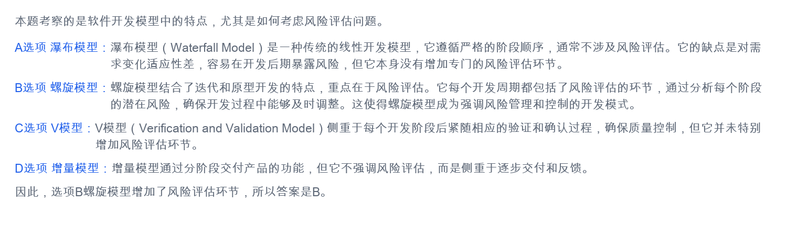

# 软件开发模型与风险评估-概念讲解

## 原始知识点



## 核心结论

如果题目强调：

```text
风险评估
风险分析
风险管理
风险控制
```

优先想到：

```text
螺旋模型
```

螺旋模型最大的特点之一，就是在每一轮迭代中都强调风险分析和风险控制。

## 软件开发模型是什么

软件开发模型用于描述软件从需求分析、设计、编码、测试到交付维护的开发过程。

不同模型关注点不同：

- 有的强调严格阶段顺序。
- 有的强调风险控制。
- 有的强调测试验证。
- 有的强调逐步交付。

考试经常让你根据关键词判断是哪一种模型。

## 瀑布模型

瀑布模型是一种传统的线性开发模型。

典型流程是：

```text
需求分析 -> 系统设计 -> 编码 -> 测试 -> 运行维护
```

它的特点是阶段清晰、顺序严格，前一个阶段完成后才进入下一个阶段。

### 适用场景

适合需求明确、变化较少、开发过程稳定的项目。

### 优点

- 阶段清楚。
- 文档规范。
- 管理简单。
- 适合计划性强的项目。

### 缺点

- 对需求变化适应性差。
- 后期才进行测试，问题发现较晚。
- 没有专门强调风险评估。

考试看到：

```text
线性、阶段顺序、文档驱动、需求稳定
```

通常想到瀑布模型。

## 螺旋模型

螺旋模型是一种迭代式开发模型，它把原型开发、瀑布模型和风险分析结合起来。

每一轮螺旋通常包括：

```text
目标确定 -> 风险分析 -> 开发验证 -> 计划下一轮
```

螺旋模型最重要的特点是：

```text
强调风险评估和风险控制
```

### 适用场景

适合大型、复杂、高风险的软件项目。

例如：

- 需求不完全明确。
- 技术方案存在不确定性。
- 项目规模大。
- 风险较高。
- 需要逐步验证方案。

### 优点

- 强调风险分析。
- 支持迭代开发。
- 能较早发现和控制风险。
- 适合复杂系统。

### 缺点

- 管理复杂。
- 成本较高。
- 需要较强的风险识别和评估能力。

考试看到：

```text
风险评估、风险分析、风险控制、迭代、螺旋
```

通常想到螺旋模型。

## V 模型

V 模型是一种强调验证和确认的软件开发模型。

它把开发阶段和测试阶段对应起来，强调每个开发阶段都有相应的测试活动。

典型对应关系：

```text
需求分析 <-> 验收测试
概要设计 <-> 系统测试
详细设计 <-> 集成测试
编码     <-> 单元测试
```

### 特点

- 重视测试。
- 开发活动和测试活动对应。
- 强调验证和确认。

### 局限

V 模型强调测试和质量控制，但它并不专门强调风险评估。

考试看到：

```text
验证、确认、测试、开发阶段与测试阶段对应
```

通常想到 V 模型。

## 增量模型

增量模型把系统分成多个增量，每次交付一部分可运行的软件功能。

开发过程可以理解为：

```text
先交付核心功能，再逐步增加新功能
```

### 特点

- 分批交付。
- 逐步完善。
- 用户能较早看到可运行系统。
- 有利于获得反馈。

### 局限

增量模型强调逐步交付和反馈，但它不以风险评估为核心特征。

考试看到：

```text
分阶段交付、逐步增加功能、增量发布、快速反馈
```

通常想到增量模型。

## 四种模型对比

| 模型 | 核心关键词 | 是否强调风险评估 |
|---|---|---|
| 瀑布模型 | 线性、阶段顺序、需求稳定 | 不强调 |
| 螺旋模型 | 迭代、风险分析、风险控制 | 强调 |
| V 模型 | 验证、确认、测试对应 | 不强调 |
| 增量模型 | 分批交付、逐步增加功能 | 不强调 |

## 截图题目解析

截图中问的是：

```text
本题考察的是软件开发模型中的特点，尤其是如何考虑风险评估问题。
```

四个选项中：

- 瀑布模型：强调线性阶段，不强调风险评估。
- 螺旋模型：每个开发周期都包含风险评估环节。
- V 模型：强调验证和确认，不强调风险评估。
- 增量模型：强调逐步交付和反馈，不强调风险评估。

因此答案是：

```text
B：螺旋模型
```

## 考试答题模板

如果考试问“哪种软件开发模型强调风险分析”，可以这样答：

```text
螺旋模型强调风险分析和风险控制。它将软件开发过程划分为多个迭代周期，
每个周期通常包括目标确定、风险分析、开发验证和下一轮计划等活动。
因此，螺旋模型适合大型、复杂、高风险的软件项目。
```
