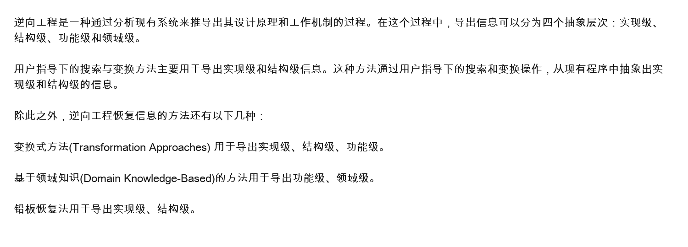

# 逆向工程信息恢复层次与方法记忆

## 原题知识点



## 一句话理解

逆向工程就是：

```text
从已有系统出发，反向分析出系统的设计原理、结构和工作机制。
```

它不是重新开发系统，而是从已有程序、文档、数据和运行行为中恢复更高层次的信息。

## 四个抽象层次

逆向工程导出的信息可以分为四个抽象层次：

```text
实现级
结构级
功能级
领域级
```

## 记忆口诀

按从低到高记：

```text
实结功领
```

展开就是：

```text
实现级 -> 结构级 -> 功能级 -> 领域级
```

可以这样理解：

```text
先看代码怎么实现
再看模块怎么组织
再看系统能做什么
最后看业务领域含义
```

## 四个层次分别记什么

| 层次 | 关注点 | 通俗理解 |
|---|---|---|
| 实现级 | 程序语句、变量、数据结构、算法细节 | 代码怎么写 |
| 结构级 | 模块、组件、调用关系、控制结构 | 程序怎么组织 |
| 功能级 | 系统功能、输入输出、业务操作 | 系统能做什么 |
| 领域级 | 业务概念、领域规则、业务模型 | 系统为什么这样做 |

## 三种恢复方法

题目中常考三种方法：

```text
变换式方法
基于领域知识的方法
铅板恢复法
```

它们对应能导出的层次如下：

| 方法 | 可导出的层次 | 记忆点 |
|---|---|---|
| 变换式方法 | 实现级、结构级、功能级 | 变换能力较强，但不到领域级 |
| 基于领域知识的方法 | 功能级、领域级 | 有领域知识，所以能到领域级 |
| 铅板恢复法 | 实现级、结构级 | 比较底层，只恢复代码和结构 |

## 最好记的版本

```text
变换：实、结、功
领域：功、领
铅板：实、结
```

再压缩成口诀：

```text
变实结功，域功领，铅实结
```

## 为什么这样记

### 1. 变换式方法：实现级、结构级、功能级

变换式方法通过对程序进行分析、抽象和转换，可以从源程序中恢复：

- 实现细节。
- 程序结构。
- 功能含义。

但它主要依赖程序本身，不一定理解具体业务领域，因此一般不说它能恢复领域级信息。

所以记为：

```text
变换 -> 实现级、结构级、功能级
```

### 2. 基于领域知识的方法：功能级、领域级

基于领域知识的方法依赖业务领域知识。

既然有领域知识，就可以识别：

- 系统完成了什么业务功能。
- 这些功能对应什么领域概念和业务规则。

所以记为：

```text
领域知识 -> 功能级、领域级
```

### 3. 铅板恢复法：实现级、结构级

铅板恢复法偏向从已有程序中恢复较底层的信息。

它主要帮助恢复：

- 实现级信息。
- 结构级信息。

所以记为：

```text
铅板 -> 实现级、结构级
```

## 考试快速判断法

如果题目问“某方法可以导出哪些层次”，直接套下面表：

```text
用户指导下的搜索与变换：实现级、结构级
变换式方法：实现级、结构级、功能级
基于领域知识方法：功能级、领域级
铅板恢复法：实现级、结构级
```

## 易错点

1. 不要把“领域级”和“功能级”混为一谈。
   - 功能级：系统能做什么。
   - 领域级：这些功能在业务领域中代表什么概念和规则。

2. 变换式方法能到功能级，但一般不到领域级。

3. 基于领域知识的方法因为有业务知识，所以能恢复领域级。

4. 铅板恢复法不要记成能恢复功能级，它主要对应实现级和结构级。

5. 四个层次的顺序要按抽象程度从低到高记：

```text
实现级 < 结构级 < 功能级 < 领域级
```

## 最终背诵版

```text
逆向工程导出信息分四层：实现级、结构级、功能级、领域级，口诀“实结功领”。
变换式方法可导出实现级、结构级、功能级；
基于领域知识的方法可导出功能级、领域级；
铅板恢复法可导出实现级、结构级。
```
