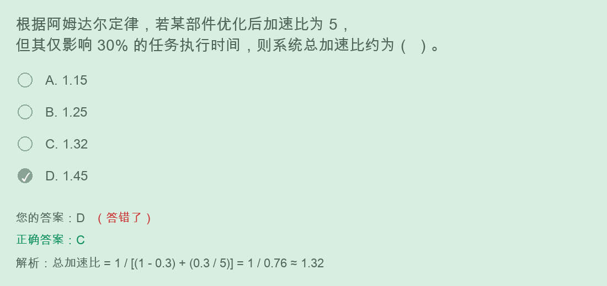

# 阿姆达尔定律加速比计算解题过程



## 题目

根据阿姆达尔定律，若某部件优化后加速比为 5，但其仅影响 30% 的任务执行时间，则系统总加速比约为（ ）。

```text
A. 1.15
B. 1.25
C. 1.32
D. 1.45
```

正确答案：

```text
C. 1.32
```

## 核心公式

阿姆达尔定律：

```text
系统总加速比 = 1 / [(1 - p) + p / s]
```

其中：

```text
p = 被优化部分占原总执行时间的比例
s = 被优化部分自身的加速比
```

本题：

```text
p = 30% = 0.3
s = 5
```

## 计算过程

代入公式：

```text
总加速比
= 1 / [(1 - 0.3) + 0.3 / 5]
= 1 / [0.7 + 0.06]
= 1 / 0.76
≈ 1.3158
≈ 1.32
```

所以答案为：

```text
C. 1.32
```

## 为什么不是 1.45

容易错在：

```text
只看到“加速比为 5”，忽略了它只影响 30% 的任务执行时间。
```

系统中还有：

```text
70% 的时间完全没有被优化
```

这部分会限制整体加速效果，所以总加速比不可能简单按局部加速比线性放大。

## 快速判断法

看到题干：

```text
某部分加速 s
只影响 p 的执行时间
```

马上写：

```text
1 / [(1 - p) + p / s]
```

本题速算：

```text
1 / (0.7 + 0.06)
= 1 / 0.76
≈ 1.32
```

## 最终背诵版

```text
阿姆达尔定律：整体加速受未优化部分限制。
总加速比 = 1 / [(1 - 优化比例) + 优化比例 / 局部加速比]。
```
